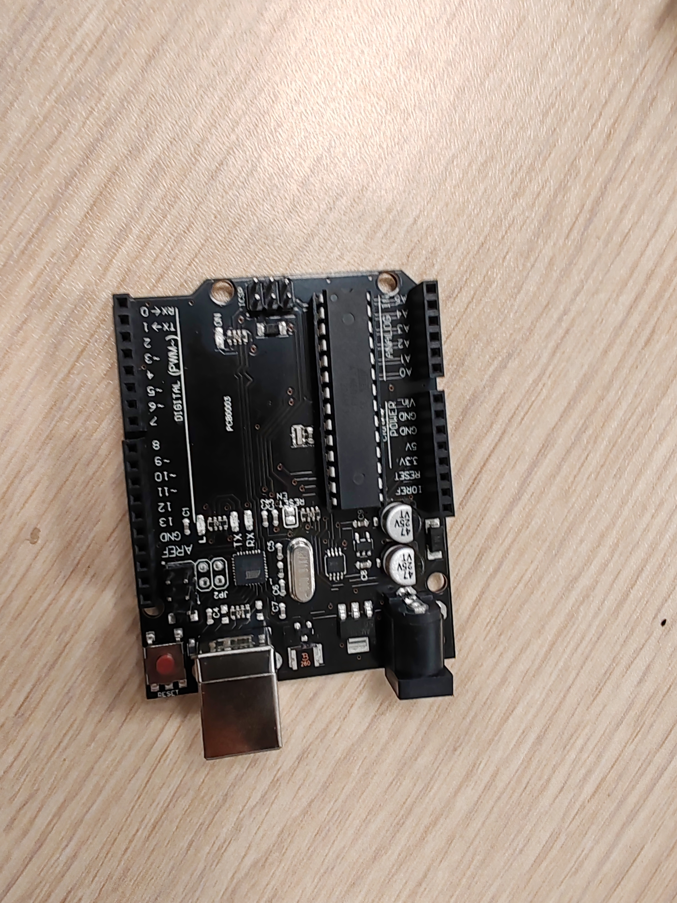
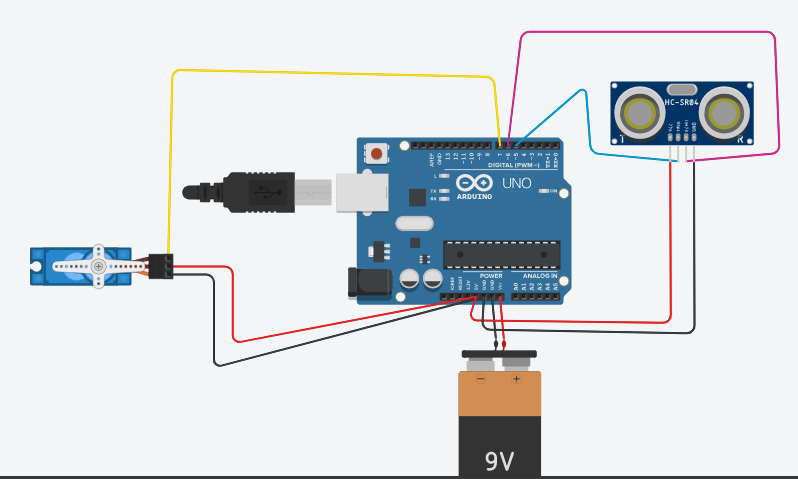

# Smart Dustbin
 
 
Smart Dustbin as its name represents its work smartly or we can say that it is an automatic dustbin.We may conclude that it's a good device for keeping your house tidy and appealing. Children distribute waste primarily through paper, rappers, and a variety of other items from home. They will enjoy themselves greatly with this dustbin as they play with it, and as they play, they also clean your home since the clever dustbin draws children every time they use it. Usually, they will be used to empty all waste and trash into this intelligent dustbin. This can be utilized if you're unable to open it manually because your hands are full of garbage or clutter. Even mosquitoes won't move because it opens automatically without touching, which can help stop the spread of the coronavirus.
  

## Component Requirement

* Arduino UNO 

* Jumper Wires 
* Servo Motor 

* Ultrasonic Sensor 

## **Software**

[Arduino IDE](https://www.arduino.cc/en/software)

## **Project Hardware Software Selection**

**Arduino UNO:** As you know that Arduino is a microcontroller-based open source electronic prototyping board that can be programmed with an easy-to-use Arduino IDE. The UNO is one of the most popular boards in Arduino family and a great choice for beginners.

**Ultrasonic Sensor:** These are the sensor that use ultrasonic waves to detect objects or to measure the distance between themselves and the object.

LINK :

[What is Ultrasonic Sensor: Working Principle & Applications](https://robocraze.com/blogs/post/what-is-ultrasonic-sensor)

**Servo Motor:** This is an electrical device that can push or pull and also rotate an object with great precision. if you want to rotate an object at some specific angles or distance, then you use servo motor. It is made up of a simple motor that runs through a servo mechanism. We can get a very high torque servo motor in a small and light weight packages.

LINK :

[SERVO MOTOR: DIAGRAM, DEFINITION, TYPES, WORKING & APPLICATIONS](https://www.theengineerspost.com/servo-motor/)

## **Circuit Diagram**

## **Code**

    #include <Servo.h>   //servo library
    Servo servo;
    int trigPin = 5;
    int echoPin = 6;  
    int servoPin = 7;
    int led= 10;
    long duration, dist, average;  
    long aver[3];   //array for average
    void setup() {
        Serial.begin(9600);
        servo.attach(servoPin);
        pinMode(trigPin, OUTPUT);
        pinMode(echoPin, INPUT);
        servo.write(0);         //close cap on power on
        delay(100);
        servo.detach();
    }
    void measure() {
     digitalWrite(10,HIGH);
    digitalWrite(trigPin, LOW);
    delayMicroseconds(5);
    digitalWrite(trigPin, HIGH);
    delayMicroseconds(15);
    digitalWrite(trigPin, LOW);
    pinMode(echoPin, INPUT);
    duration = pulseIn(echoPin, HIGH);
    dist = (duration/2) / 29.1;    //obtain distance
    }
    void loop() {
      for (int i=0;i<=2;i++) {   //average distance
        measure();
       aver[i]=dist;
        delay(10);              //delay between measurements
      }
     dist=(aver[0]+aver[1]+aver[2])/3;
    if ( dist<50 ) {
    //Change distance as per your need
     servo.attach(servoPin);
      delay(1);
     servo.write(0);
     delay(3000);
     servo.write(150);
     delay(1000);
     servo.detach();
    }
    Serial.print(dist);
    }

## **RESULT**

<video width="700" controls>
  <source src="video.mp4" type="video/mp4">
  <source src="video.ogg" type="video/ogg">
Your browser does not support the video tag.
</video>
