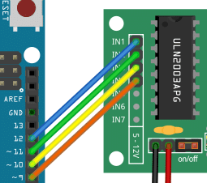

## Description 
Stepper motors are widely used in various applications, such as robotics, CNC machines, and 3D printers, due to their precise control and ability to move in small increments. By combining the stepper motor with an IR remote control, we can create a wireless control system for our projects.

We will be using the ULN2003 driver module to interface the stepper motor with the Arduino. The ULN2003 is a popular driver chip that simplifies the control of stepper motors by providing the necessary current amplification and protection circuitry. It allows us to control the stepper motor using just a few digital pins of the Arduino.For the stepper motor, we use a 28byj-48 stepper motor. It is very affordable, compact and runs on 5-12 Volts, which makes it easy to integrate with Arduino and battery powered projects.

By the end of this tutorial, you will have a clear understanding of how to connect the components, write the Arduino code, and control the stepper motor using an IR remote control.

## Required Parts

1. Arduino Uno
2. Dupont Wire Set
3. Breadboard
4. USB Cable for Arduino UNO
5. IR Receiver Module
6. IR Remote Receiver Kit
7. Stepper Motor
8. Arduino IDE

 

## Connecting the Parts
In this section we will connect the components to the Arduino.  Since the stepper motor consumes more power than the Arduino can supply, we add a breadboard with an additional power supply. The breadboard will also carry the IR sensor, which needs to be connected to power and an input pin of the Arduino. The picture below shows  the complete wiring.

  

## Connecting the Stepper Motor and Driver
Let’s start by connecting the stepper motor to the driver board.

The 28byj-48 stepper motor typically comes with a connector that directly fits into the socket on the driver board. Just plugin it in. It will fit only in one orientation.

  

Next, we connect the input signals for the motor driver to the output pins of the Arduino board:

  

| Arduino   | Driver module  |
| --------  | -------        |
| Pin 12    | INA            |
| Pin 11    | INB            |
| Pin 10    | INC           |
| Pin 9     | IND            |

We finish the wiring of the driver by connecting the power for the driver board to the breadboard. Make sure the red wire connect the positive input of the driver board with the positive power rail on the breadboard (marked by a red line). The black wire connects the negative side to ground (GND).

## Connecting the IR Sensor
Now, let’s place the infrared (IR) sensor on the breadboard and connect it. The negative pin is marked with a (-) sign. We use a black wire to connect this pin to the ground rail of the breadboard. This means the sensor and the driver board using the same ground.

  

The middle pin of the sensor is typically plus. We need to connect this to the 5V output of the Arduino. Below you see the red wire running from the center pin of the IR sensor to the 5V output of the Arduino board.

  

## Writing the Arduino Code
In this section we will write the code to control the stepper motor from an IR remote. Specifically, we want to be able to control speed and direction of the stepper motor. In addition, it would be nice if we could stop and start the motor with the press of a button.

The code below does all of that. We will break it into pieces and explain its parts in the following sections.

     #include <IRremote.h>
     #include <AccelStepper.h>

     #define IR_RECEIVE_PIN 8
     #define INA_PIN 12
     #define INB_PIN 11
     #define INC_PIN 10
     #define IND_PIN 9
     #define TYPE AccelStepper::HALF4WIRE
     #define MAXSPEED 1000
     #define MINSPEED 100
     
     int currspeed = 500;
     int prevspeed = 500;
     int inc = 1000;
     int dir = +1;
     
     // Note the pin order 1,3,2,4!
     auto stepper = AccelStepper(TYPE, INA_PIN, INB_PIN, INC_PIN, IND_PIN);
     
     void setup() {
       IrReceiver.begin(IR_RECEIVE_PIN, ENABLE_LED_FEEDBACK);
       stepper.setMaxSpeed(MAXSPEED);
     }
     
     void loop() {
       if (IrReceiver.decode()) {
         uint16_t command = IrReceiver.decodedIRData.command;
         if (command == 31) {         // VOL+
           prevspeed = currspeed;
           currspeed = min(currspeed + inc, MAXSPEED);
         } else if (command == 23) {  // VOL-
           prevspeed = currspeed;
           currspeed = max(currspeed - inc, MINSPEED);
         } else if (command == 21) { // MODE
           dir = -dir;
           delay(200);
         } else if (command == 7) {  // PLAY or PAUSE
           currspeed = currspeed > 0 ? 0 : prevspeed;
           delay(200);
         }
         IrReceiver.resume();
       }
       stepper.setSpeed(dir * currspeed);
       stepper.runSpeed();
     }

## Installing the Libraries
First, we need two libraries. IRremote, which is used to read and interpret the signals sent from the IR remote. And AccelStepper, which will make it very easy for us to control the stepper motor. If you don’t have these two libraries already installed, you will need to install them.

     #include <IRremote.h>
     #include <AccelStepper.h> 

## Defining the Constants

Next, we define the constants we will use in the remainder of the code. First, we define the pins for the IR sensor (PIN 8) and the four output pins on the Arduino board that are connected to the input pins of the stepper motor driver (IN1_PIN, …, IN4_PIN)

    #define IR_RECEIVE_PIN 8
    #define IN1_PIN 12
    #define IN2_PIN 11
    #define IN3_PIN 10
    #define IN4_PIN 9

In addition, we need to let the stepper library know, which type of stepper motor we have connected (HALF4WIRE). We also want to specify a maximum and a minimum speed (1000…100). For more details see our tutorial 28BYJ-48 Stepper Motor with ULN2003 Driver and Arduino.

    #define TYPE AccelStepper::HALF4WIRE
    #define MAXSPEED 1000
    #define MINSPEED 100

## Defining the Variables
Since we want to be able to control the speed of the stepper motor, we need a few variables in addition to the constants above. Specifically, we require the current speed (currspeed), the previous speed of the motor (lastspeed), and the increment (inc) to speed up or slow down the motor. We also have a variable dir, which is either +1 or -1 and determines the direction of rotation.

    int currspeed = 500;
    int prevspeed = 500;
    int inc       = 100;
    int dir       = +1;

Lastly, we create the stepper motor object (stepper), which we need to send commands to the stepper motor.

      auto stepper = AccelStepper(TYPE, IN1_PIN, IN3_PIN, IN2_PIN, IN4_PIN);   

## The Setup Function
The setup function, where we initialize the board, is very simple. We just let the sensor library know, which pins are used for the IR sensor and set the initial speed of the stepper motor to MAXSPEED.
     
     
    void setup() {
    receiver.begin(IR_RECEIVE_PIN, ENABLE_LED_FEEDBACK);
    pper.setMaxSpeed(MAXSPEED);
                }

## The Loop Function

All the real action happens in the main loop. Here, we first wait for the IR receiver. If it gets a signal to decode, we decode it and extract the specific command the IR remote sent. Depending on the value of the command variable we either speed up, slow down, change direction or switch between stop and run.

     void loop() {
       if (IrReceiver.decode()) {
     uint16_t command = IrReceiver.decodedIRData.command;
      if (command == 31) {         // VOL+
      prevspeed = currspeed;
      currspeed = min(currspeed + inc, MAXSPEED);
     } else if (command == 23) {  // VOL-
      prevspeed = currspeed;
      currspeed = max(currspeed - inc, MINSPEED);
    } else if (command == 21) { // MODE
      dir = -dir;
      delay(200);
    } else if (command == 7) {  // PLAY or PAUSE
      currspeed = currspeed > 0 ? 0 : prevspeed;
      delay(200);
    }
     IrReceiver.resume();
    }
     stepper.setSpeed(dir * currspeed);    
     stepper.runSpeed();
     }

The command codes are mapped to specific keys (Vol+->31, Vol–>23, Mode->21, Play/Pause->7) on the IR remote. This mapping will depend on the IR remote you are using! To figure out, which keys correspond to which command codes for you remote have a look at our tutorial on How to use an IR receiver and remote with Arduino.

There are some interesting details in the code. Firstly, if we speed up, we need to avoid going faster than MAXSPEED. The min() function ensures that. Similarly, when we slow down, we use the max() function to ensure that we don’t go below MINSPEED.

Change of direction is easy, whenever I press MODE on my remote, the IR receiver reads the command code 21, and we simply change the sign of the dir variable. Note that the dir variable is used later in the code when the speed is set via stepper.setSpeed(dir*currspeed), and determines the direction of rotation (+1 = clockwise, -1 = counter-clockwise).

The last command is to toggle between run or stop using the PLAY/PAUSE key on my remote. We use a ternary condition (c ? a : b) here to check if the current speed if greater than zero. If that is the case, it means the motor is running and we set current speed to zero stop. Alternatively, if the motor is not running (speed is zero), we set the speed to the last known speed (prevspeed).

## Result

  
 
 

<video width="600" height="400" controls>
<source src="ir.mp4" type="video/mp4">
<source src="ir.ogg" type="video/ogg">
Your browser does not support the video tag.
</video>
 
 
   
## Applications
There is a lot you can do with an IR controlled servo motor. Here are some fun ideas and possible applications:

**Automated Blinds or Curtains**
Use the stepper motor to control the opening and closing of blinds or curtains in response to commands from the IR remote. This can be a convenient addition to home automation systems.

**Robotic Arm**
Build a small robotic arm that can be controlled using the IR remote. The stepper motor can be used to control the movement of the arm, allowing it to pick up and manipulate objects.

**Automated Pet Feeder**
Create an automated pet feeder that dispenses food at specific times or in response to commands from the IR remote. The stepper motor can be used to control the release mechanism.

**Plant Watering System**
Build a system that waters plants automatically based on a schedule or commands from the IR remote. The stepper motor can be used to control the flow of water or the movement of a watering arm.

**Garage Door Opener**
Use the stepper motor to control the opening and closing of a garage door in response to commands from the IR remote. This can be a useful addition to a home automation system.

**Robotic Vacuum Cleaner**
Create a small robotic vacuum cleaner that can be controlled using the IR remote. The stepper motor can be used to control the movement of the vacuum cleaner, allowing it to navigate around a room.

**Automated Fish Feeder**
Build an automated fish feeder that dispenses food at specific times or in response to commands from the IR remote. The stepper motor can be used to control the release mechanism.

**Smart Door Lock**
Use the stepper motor to control the locking and unlocking of a door in response to commands from the IR remote. This can be a convenient addition to a home automation system.

**Automated Window Opener**
Create a system that automatically opens and closes windows based on temperature or commands from the IR remote. The stepper motor can be used to control the movement of the window.

**Robotic Bartender**
Build a robotic bartender that can mix and serve drinks based on commands from the IR remote. The stepper motor can be used to control the movement of the drink dispensing mechanism.

## Conclusions

We have done how to control a 28byj-48 stepper motor using an IR remote and an ULN2003 driver with the help of an Arduino board. We started by gathering the necessary parts, including the 28byj-48 stepper motor, an IR remote, an ULN2003 driver, and an Arduino board. We then connected these components together, ensuring that the wiring was correct and secure.Next, we wrote the Arduino code to receive IR remote signals and translate them into specific motor movements. By utilizing the IRremote library, we were able to easily capture and interpret the signals sent by the remote control. We then used the ULN2003 driver to control the stepper motor, providing the necessary power and signals to drive the motor in the desired direction and speed.

In conclusion, controlling a 28byj-48 stepper motor with an IR remote using an ULN2003 driver is a fun and practical project that opens up a world of possibilities for automation and robotics. Whether you’re building a camera slider, a robotic arm, or any other project that requires precise motor control.