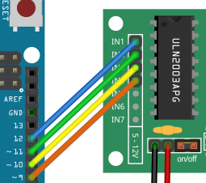
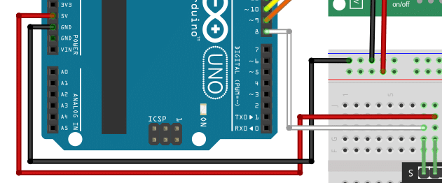

## 描述
步进电动机广泛用于各种应用中，例如机器人技术，CNC机器和3D打印机，因为它们的精确控制和少量移动的能力。通过将步进电机与红外遥控器相结合，我们可以为项目创建无线控制系统。

我们将使用ULN2003驱动器模块将步进电机与Arduino连接在一起。ULN2003是一种流行的驱动器芯片，可通过提供必要的电流放大和保护电路来简化对步进电机的控制。它允许我们仅使用Arduino的几个数字引脚来控制步进电机。对于步进电机，我们使用28ByJ-48步进电机。它非常实惠，紧凑，并在5-12伏上运行，这使得与Arduino和电池供电的项目变得容易。

在本教程结束时，您将对如何连接组件，编写Arduino代码并使用IR遥控器控制步进电机有清晰的了解。

## 所需零件
1. Arduino Uno
2. 杜邦电线套件
3. 面包板
4. Arduino Uno的USB电缆
5. 红外接收器模块
6. 红外远程接收器套件
7. 步进马达
8. Arduino IDE
 

## 连接零件
在本节中，我们将将组件连接到Arduino。由于步进电机的功率比Arduino提供的功率更多，因此我们添加了一个带有额外电源的面包板。面包板还将携带IR传感器，该传感器需要连接到电源和Arduino的输入引脚。下图显示了完整的接线。

  

## 连接步进电机和驾驶员
让我们从将步进电机连接到驾驶员板开始。

28ByJ-48步进电动机通常配有一个直接适合驾驶员插座的连接器。只需将其插入即可。它仅适合一个方向。

  

接下来，我们将电机驱动器的输入信号连接到Arduino板的输出引脚：

  

| Arduino   | Driver module  |
| --------  | -------        |
| Pin 12    | INA            |
| Pin 11    | INB            |
| Pin 10    | INC           |
| Pin 9     | IND            |

我们通过将驾驶员板的电源连接到面包板来完成驾驶员的接线。确保红线连接驾驶员板的正输入，并在面包板上的正功率导轨（以红线为标记）。黑线将负面连接到地面（GND）。

## 连接红外传感器
现在，让我们将红外线（IR）传感器放在面包板上，然后将其连接。负引脚用（ - ）标志标记。我们使用黑色电线将这销连接到面包板的地面轨道上。这意味着传感器和驾驶员板使用相同的地面。

  
传感器的中销通常是加上的。我们需要将其连接到Arduino的5V输出。在下面，您可以看到从红外传感器的中心引脚到Arduino板的5V输出的红线。

  

## 编写Arduino代码
在本节中，我们将编写代码以控制IR遥控器的步进电机。具体来说，我们希望能够控制步进电机的速度和方向。此外，如果我们可以停下来使用按钮按下按钮，那就太好了。

下面的代码完成了所有这些。我们将在以下各节中将其分成部分并解释其部分。

     #include <IRremote.h>
     #include <AccelStepper.h>

     #define IR_RECEIVE_PIN 8
     #define INA_PIN 12
     #define INB_PIN 11
     #define INC_PIN 10
     #define IND_PIN 9
     #define TYPE AccelStepper::HALF4WIRE
     #define MAXSPEED 1000
     #define MINSPEED 100
     
     int currspeed = 500;
     int prevspeed = 500;
     int inc = 1000;
     int dir = +1;
     
     // Note the pin order 1,3,2,4!
     auto stepper = AccelStepper(TYPE, INA_PIN, INB_PIN, INC_PIN, IND_PIN);
     
     void setup() {
       IrReceiver.begin(IR_RECEIVE_PIN, ENABLE_LED_FEEDBACK);
       stepper.setMaxSpeed(MAXSPEED);
     }
     
     void loop() {
       if (IrReceiver.decode()) {
         uint16_t command = IrReceiver.decodedIRData.command;
         if (command == 31) {         // VOL+
           prevspeed = currspeed;
           currspeed = min(currspeed + inc, MAXSPEED);
         } else if (command == 23) {  // VOL-
           prevspeed = currspeed;
           currspeed = max(currspeed - inc, MINSPEED);
         } else if (command == 21) { // MODE
           dir = -dir;
           delay(200);
         } else if (command == 7) {  // PLAY or PAUSE
           currspeed = currspeed > 0 ? 0 : prevspeed;
           delay(200);
         }
         IrReceiver.resume();
       }
       stepper.setSpeed(dir * currspeed);
       stepper.runSpeed();
     }

## 安装库
首先，我们需要两个库。Inremote，用于读取和解释从IR遥控器发送的信号。和Accelstepper，这将使我们很容易控制步进电机。如果您已经安装了这两个库，则需要安装它们。

     #include <IRremote.h>
     #include <AccelStepper.h> 

## 定义常数

接下来，我们定义将在剩余代码中使用的常数。首先，我们定义IR传感器（引脚8）的引脚和Arduino板上的四个输出引脚连接到步进电动机驱动器的输入引脚（In1_pin，…，In4_pin）

    #define IR_RECEIVE_PIN 8
    #define IN1_PIN 12
    #define IN2_PIN 11
    #define IN3_PIN 10
    #define IN4_PIN 9

此外，我们需要让步进库知道我们已连接的哪种步进电动机（Half4Wire）。我们还希望指定最高速度和最低速度（1000…100）。有关更多详细信息，请参见我们的教程28ByJ-48步进电动机，带有ULN2003驾驶员和Arduino。

    #define TYPE AccelStepper::HALF4WIRE
    #define MAXSPEED 1000
    #define MINSPEED 100

## 定义变量
由于我们希望能够控制步进电机的速度，因此除了上面的常数外，我们还需要一些变量。具体来说，我们需要电流速度（Currspeed），电动机的先前速度（LastSpeed）和增量（INC）来加快或减速电动机。我们也有一个可变DIR，即+1或-1，并确定旋转方向。

    int currspeed = 500;
    int prevspeed = 500;
    int inc       = 100;
    int dir       = +1;

最后，我们创建了步进电机对象（步进），我们需要将命令发送到步进电机。

      auto stepper = AccelStepper(TYPE, IN1_PIN, IN3_PIN, IN2_PIN, IN4_PIN);   

## 设置功能
我们初始化板的设置功能非常简单。我们只是让传感器库知道，哪个针线用于IR传感器，并将步进电动机的初始速度设置为MaxSpeed。
     
     
    void setup() {
    receiver.begin(IR_RECEIVE_PIN, ENABLE_LED_FEEDBACK);
    pper.setMaxSpeed(MAXSPEED);
                }

## 循环功能

所有真实的动作都会发生在主循环中。在这里，我们首先等待红外接收器。如果它具有解码的信号，我们将其解码并提取IR遥控器发送的特定命令。根据命令变量的值，我们要么加速，减速，更改方向或在停止和运行之间切换。

     void loop() {
       if (IrReceiver.decode()) {
     uint16_t command = IrReceiver.decodedIRData.command;
      if (command == 31) {         // VOL+
      prevspeed = currspeed;
      currspeed = min(currspeed + inc, MAXSPEED);
     } else if (command == 23) {  // VOL-
      prevspeed = currspeed;
      currspeed = max(currspeed - inc, MINSPEED);
    } else if (command == 21) { // MODE
      dir = -dir;
      delay(200);
    } else if (command == 7) {  // PLAY or PAUSE
      currspeed = currspeed > 0 ? 0 : prevspeed;
      delay(200);
    }
     IrReceiver.resume();
    }
     stepper.setSpeed(dir * currspeed);    
     stepper.runSpeed();
     }

命令代码映射到IR遥控器上的特定键（Vol+ - > 31，Vol-> 23，模式 - > 21，Play/pape-> 7）。该映射将取决于您使用的IR遥控器！要弄清楚，哪些键对应于您的遥控器命令代码，请查看我们的教程如何使用IR接收器和Arduino遥控器。

代码中有一些有趣的细节。首先，如果我们加快速度，我们需要避免比MaxSpeed快。min（）函数确保了这一点。同样，当我们放慢速度时，我们会使用max（）函数来确保我们不会低于minspeed。

更改方向很容易，每当我按遥控器上的模式时，红外接收器都会读取命令代码21，我们只需更改DIR变量的符号即可。请注意，当通过stepper.setspeed（dir*currspeed）设置速度时，DIR变量将在稍后在代码中使用，并确定旋转方向（+1 =顺时针，-1 =逆时针）。

最后一个命令是在运行或停止使用遥控器上的play/暂停键之间切换。我们在此处使用三元条件（C？a：b）检查当前速度是否大于零。如果是这种情况，则意味着电动机正在运行，我们将电流速度设置为零停止。或者，如果电动机不运行（速度为零），我们将速度设置为最后已知的速度（PrevSpeed）。

## 结果

  
 
 

<video width="600" height="400" controls>
<source src="ir.mp4" type="video/mp4">
<source src="ir.ogg" type="video/ogg">
Your browser does not support the video tag.
</video>
 
 
   
## 申请
IR控制的伺服电机可以做很多事情。以下是一些有趣的想法和可能的应用：

**自动百叶窗或窗帘**
使用步进电机来控制IR遥控器的命令的百叶窗或窗帘的开口和关闭。这可能是家庭自动化系统的方便补充。

**机器人手臂**
建立一个可以使用IR遥控器控制的小机器人臂。步进电动机可用于控制手臂的运动，从而使其拾起并操纵物体。

**自动化宠物喂食器**
创建一个自动化的宠物喂食器，该宠物喂食器在特定时间或响应IR遥控器的命令中分配食物。步进电机可用于控制释放机构。

**植物浇水系统**
构建一个系统，该系统会根据附表或IR遥控器的命令自动浇水。步进电动机可用于控制水的流动或浇水臂的运动。

**车库门开启器**
使用步进电动机来控制车库门的开口和关闭，以响应IR遥控器的命令。这可能是家庭自动化系统的有用补充。

**机器人真空吸尘器**
创建一个可以使用IR遥控器来控制的小机器人真空吸尘器。步进电机可用于控制真空吸尘器的运动，从而使其在房间周围导航。

**自动鱼喂食器**
建立一个自动化的鱼类喂食器，该喂食器在特定时间或响应IR遥控器的命令时分配食物。步进电机可用于控制释放机构。

**智能门锁**
使用步进电动机来控制IR遥控器的命令的锁定和解锁门的锁定和解锁。这可能是家庭自动化系统的方便补充。

**自动化窗口开启器**
创建一个系统，该系统会根据温度或IR遥控器的命令自动打开和关闭窗口。步进电动机可用于控制窗户的运动。

**机器人调酒师**
建立一个机器人调酒师，可以根据IR遥控器的命令混合和提供饮料。步进电机可用于控制饮料分配机构的运动。

## 结论

我们完成了如何在Arduino板的帮助下使用IR遥控器和ULN2003驱动器控制28ByJ-48步进电机。我们首先收集必要的零件，包括28ByJ-48步进电机，IR遥控器，ULN2003驾驶员和Arduino板。然后，我们将这些组件连接在一起，以确保接线是正确且安全的。次要，我们编写了Arduino代码以接收IR远程信号并将其转换为特定的电机运动。通过利用Inremote库，我们能够轻松捕获和解释遥控器发送的信号。然后，我们使用ULN2003驱动器来控制步进电机，从而提供必要的功率和信号，以使电动机以所需的方向和速度驱动。

总之，使用ULN2003驱动程序控制28ByJ-48步进电动机是一个有趣而实用的项目，它为自动化和机器人技术的可能性打开了世界。无论您是构建相机滑块，机器人臂还是其他需要精确电机控制的项目。