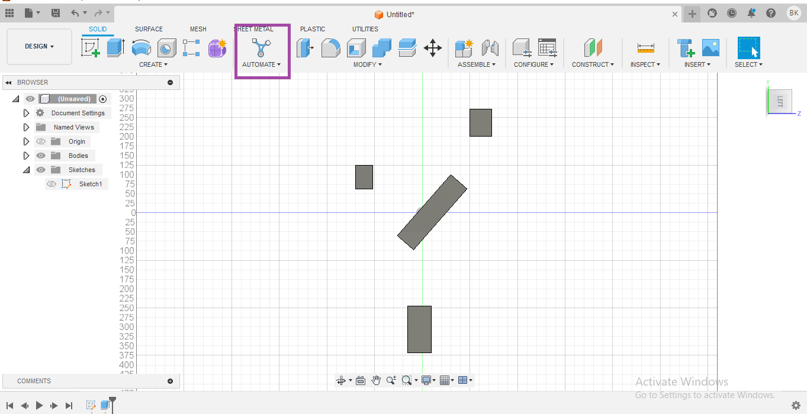
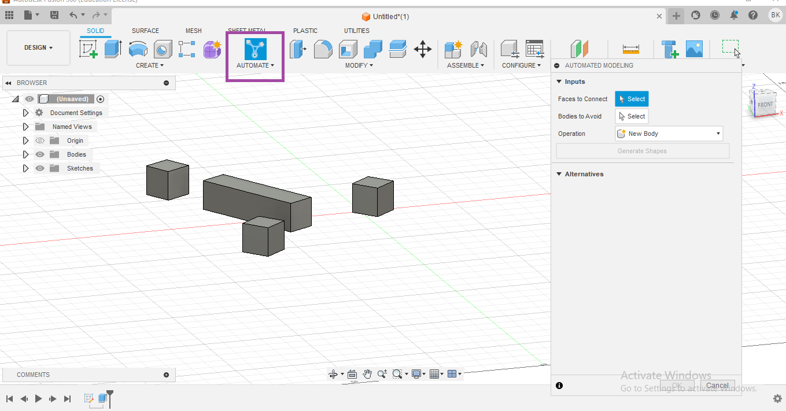
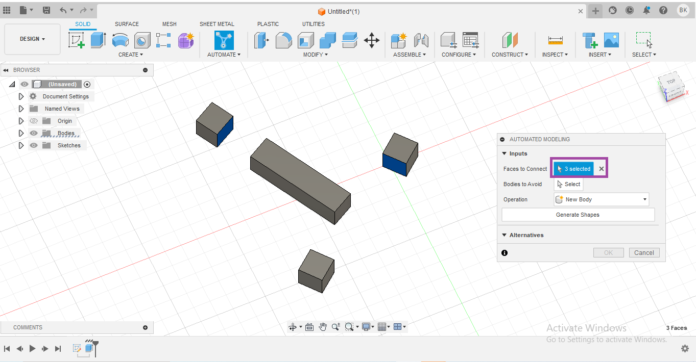
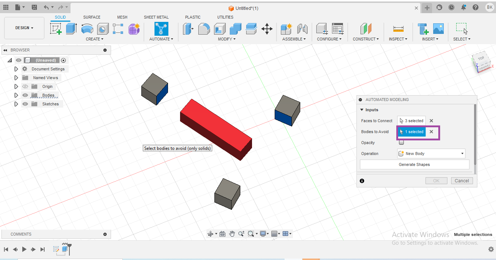
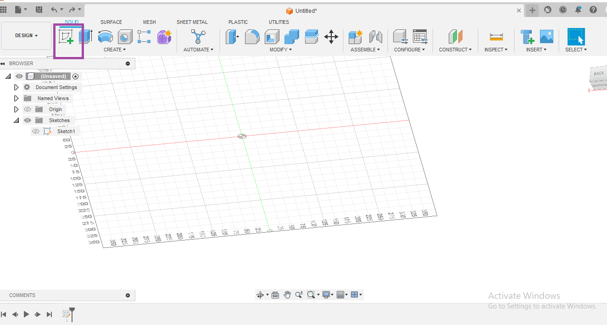
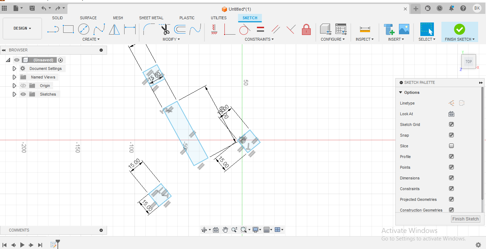
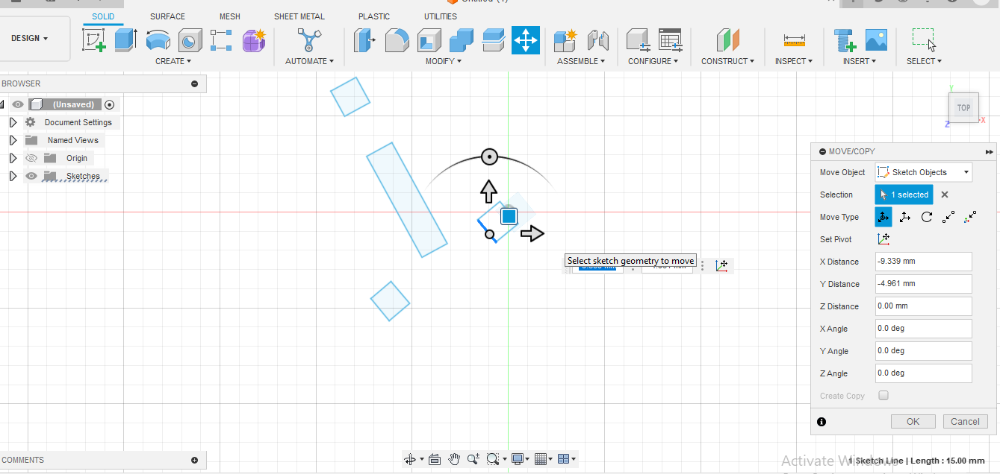
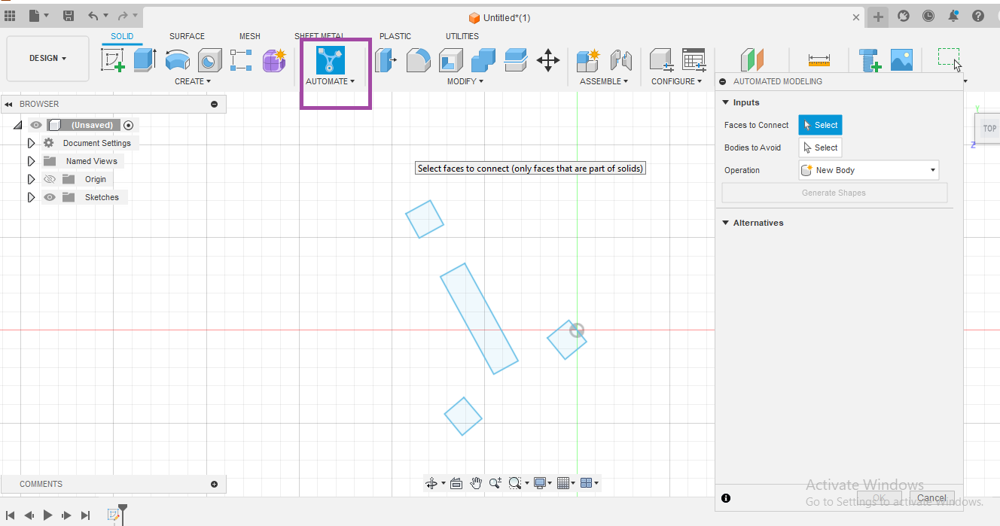
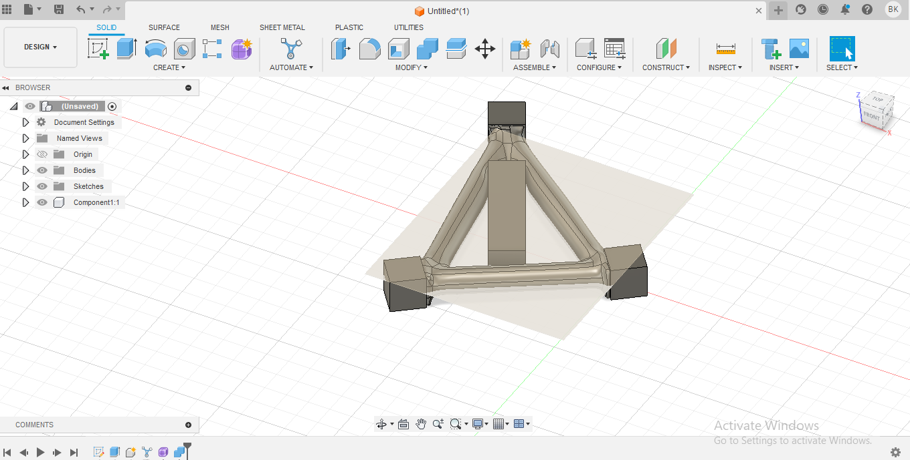
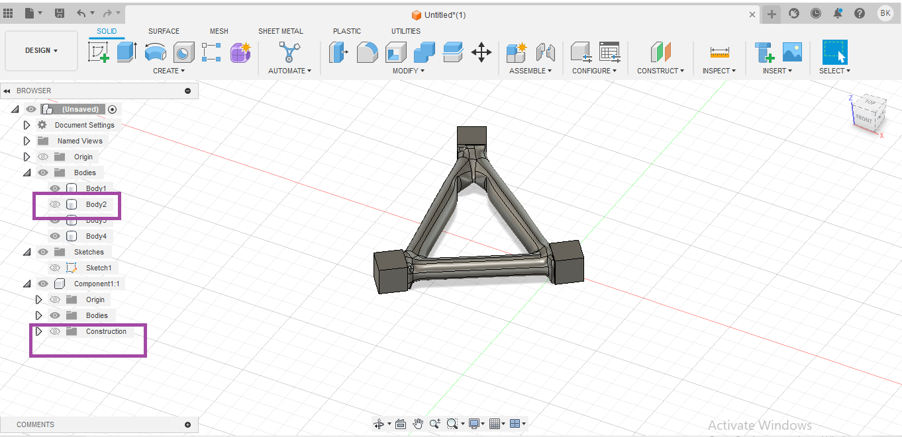

Blinking LED with NodeMCU (ESP8266) and Arduino IDE
This is a simple example of a project that uses an Arduino board to program a NodeMCU (ESP8266) to control an LED. The Arduino board will send commands to the NodeMCU over serial communication, and the NodeMCU will control the LED accordingly.

Arduino Code (Sender):
```
void setup() {
  Serial.begin(9600);
  pinMode(LED_BUILTIN, OUTPUT);
}

void loop() {
  // Send command to NodeMCU
  Serial.println("ON");
  delay(1000);  // Wait for a second
  Serial.println("OFF");
  delay(1000);  // Wait for a second
}
```
NodeMCU Code (Receiver):

```
-- Set LED pin
local ledPin = 4  -- D4 on NodeMCU

-- Configure LED pin as output
gpio.mode(ledPin, gpio.OUTPUT)

-- Function to toggle LED state
function toggleLED(state)
    if state == "ON" then
        gpio.write(ledPin, gpio.HIGH)
    elseif state == "OFF" then
        gpio.write(ledPin, gpio.LOW)
    end
end

-- Set up UART communication
uart.setup(0, 9600, 8, uart.PARITY_NONE, uart.STOPBITS_1, 0)

-- Receive and process commands
uart.on("data", "\n", function(data)
    toggleLED(data)
end)

```
In this example:

The Arduino board (sender) sends serial commands "ON" and "OFF" to the NodeMCU over a serial connection.
The NodeMCU (receiver) reads the serial commands, and based on the received command, it toggles the state of an LED connected to pin D4.
Make sure to connect the NodeMCU's D4 pin to the positive leg of an LED with a current-limiting resistor, and the negative leg of the LED to the ground (GND) pin on the NodeMCU.

## NodeMcu with Aliyun-IOT
The Internet of Things (IoT) is a system of interrelated computing devices, mechanical and digital machines, objects, animals or people that are provided with unique identifiers and the ability to transfer data over a network without requiring human-to-human or human-to-computer interaction.
NodeMCU is an open source IoT platform. It includes firmware which runs on the ESP8266 WiFi SoC from Espressif, and hardware which is based on the ESP-12 module. 
It can be used as a standalone device, or as a UART to Wi-Fi adaptor to allow other microcontrollers to connect to a Wi-Fi network. For example, you can connect an ESP8266 to an Arduino to add Wi-Fi capabilities to your Arduino board. The most practical application is using it as a standalone device.

## Features
* Wi-Fi Module – ESP-12E module similar to the ESP-12 module but with 6 extra GPIOs.
* USB – micro USB port for power, programming and debugging
* Headers – 2x 2.54mm 15-pin header with access to GPIOs, SPI, UART, ADC, and power pinsMisc – Reset and Flash buttons
* Power – 5V via micro USB port

Arduino-like (software defined) hardware IO.
Can be programmed with the simple and powerful Lua programming language or Arduino IDE.
* 10 GPIOs D0-D10, PWM functionality, IIC and SPI communication, 1-Wire and ADC A0 etc. all in one board.
* Wifi networking (can be used as access point and/or station, host a web server), connect to internet to fetch or upload data.
* Event-driven API for network applications.
* PCB antenna.

steps
[Register with Alibaba Cloud to create a device](.https://ecs.console.aliyun.com/home)
<br>

<br>
After Registering, log in and select the language suitable for you
  
<br>

<br>
Search the IoT platform in the search box and select the IoT platform 
<br>

<br>
If this is the first time to use this platiform select purchase instances and complete the process to activate an instance 
<br>

<br>
In the left-side navigation pane, choose Products. On the page that appears, click Create Product.On the Create Product page, configure the parameters and click OK.

In this example, the Product Name parameter is set to project1 and the default values are used for other parameters, as shown in the following figure.
<br>

<br>
In the left-side navigation pane, choose device and click on Add device to create your own device, 
<br>

<br>
Select the product and add the name of the produect and click OK. In the example the name, Dht_11
<br>

<br>
Navigate to the product and Click on  the product created.
<br>

<br>
Click on the define feature and click on the edit draft as shown below
set the parameters 
<br>

<br>
Click on Add self-defined feature
<br>

<br>
In the Default Module section, click Add Self-defined Feature and then define the temperature and humidity properties.
<br>

<br>
<br>

<br>
Remember the  Identifier as it is the one that will be used in Arduino programing
<br>

<br>
Choose Define Feature > Edit Draft. In the lower left corner of the page that appears, click Release online. The Release model online? dialog box appears.
<br>

<br>
Select Make sure that you have verified the differences between the current version and the online version. Click OK
<br>

<br>
Navigate to the device panel and select the device name and click view
<br>

<br>
<br>
Click view on the device secret

<br>
A device certificate consists of a ProductKey, a DeviceName, and a DeviceSecret. A device certificate is the credential that a device uses to communicate with IoT Platform.

5. After entering, click Add Device to create your own device, here is D001 (the current display is offline, because I have already connected, it should be inactive just after creation) and then click on the right to view device properties
6. Click View on the device information interface to view and obtain the triplet of the device
2. Prepare to connect to Alibaba Cloud and generate a message

## Reference
[https://www.instructables.com/Internet-Controlled-LED-Using-NodeMCU/](NodeMCU)
