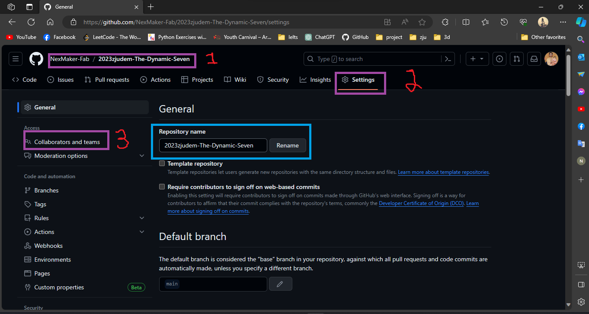
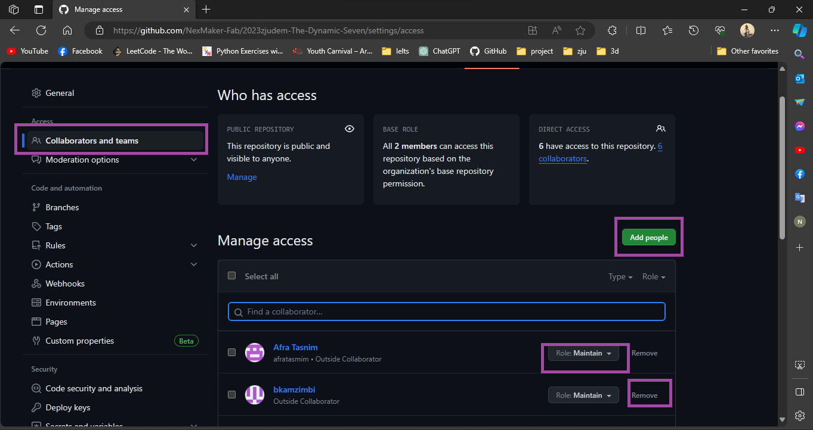
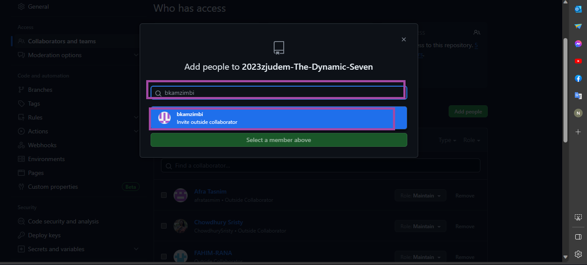
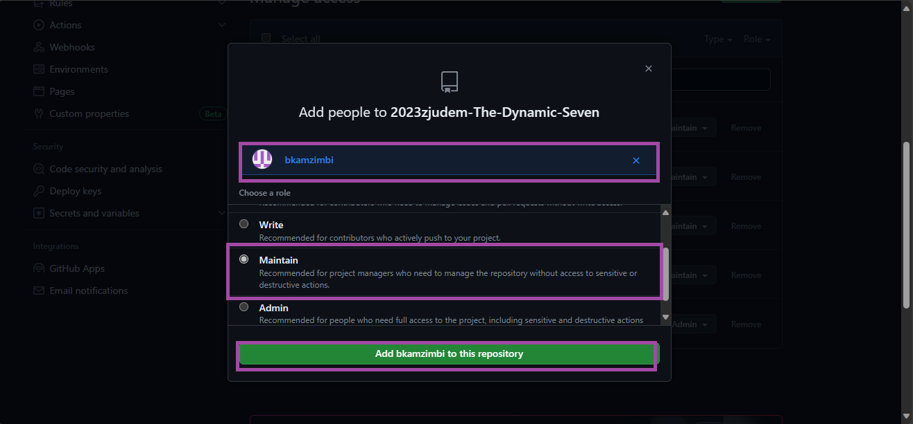
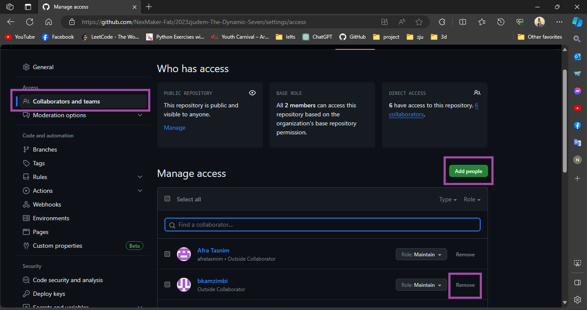
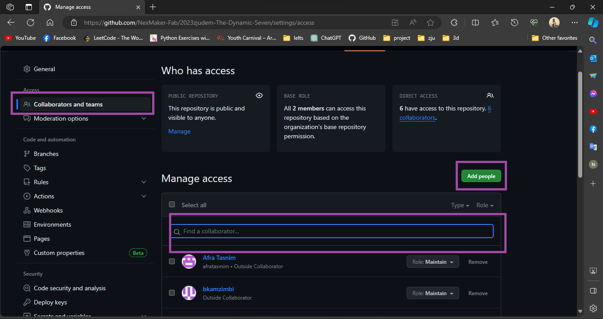
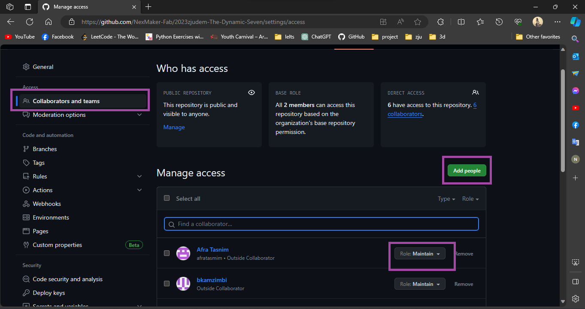

### 1. Inviting a team or person

**Step1:**  Ask for the username of the person you're inviting as a collaborator.

**Step2:** On GitHub.com, navigate to the main page of the repository as shown in the letter **labeled 1** in below figure

 

 

**Step 3:** Under your repository name, click  **Settings** as shown in a letter **labeled 2** on the figure above . If you cannot see the "Settings" tab, select the  dropdown menu, then click **Settings**.

**Step 4:** In the **"Access"** section of the sidebar, click **Collaborators and teams** as displayed in letter **labeled 3.**

 

 

**Step 5:** To the right of **"Manage access",** click **Add people or Add teams.**

**Step 6:** In the search field, start typing the name of the team or person to invite, then click a name in the list of matches.

 

 

**Step 7:** Under "Choose a role", select the repository role to grant to the team or person, then click **Add NAME to REPOSITORY**.

### 2. Removing access for a team or person

**Step1:** On GitHub.com, navigate to the main page of the repository.

**Step 2:** Under your repository name, click  **Settings**. If you cannot see the "Settings" tab, select the  dropdown menu, then click **Settings**.

**Step 3:** In the "Access" section of the sidebar, click  **Collaborators & teams.**

**Step 4:** Under "Manage access", next to the team or person whose access you'd like to remove, click **Remove.**

 

 

### 3. Filtering the list of teams and people

**Step 1:** On GitHub.com, navigate to the main page of the repository.

**Step 2:** Under your repository name, click  **Settings**. If you cannot see the "Settings" tab, select the  dropdown menu, then click **Settings.**

**Step 3:** In the "Access" section of the sidebar, click  **Collaborators & teams.**

**Step4:** Under "Manage access", in the search field, start typing the name of the team or person you'd like to find. Optionally, use the dropdown menus to filter your search.
 

 

### 4. Changing permissions for a team or person

**Step 1:** On GitHub.com, navigate to the main page of the repository.

**Step 2:** Under your repository name, click  **Settings**. If you cannot see the "Settings" tab, select the  dropdown menu, then click **Settings**.

**Step 3:** In the "Access" section of the sidebar, click  **Collaborators & teams.**

**Step4:** Under "Manage access", next to the team or person whose role you'd like to change, select the Role dropdown menu, and click a new role.

 

 