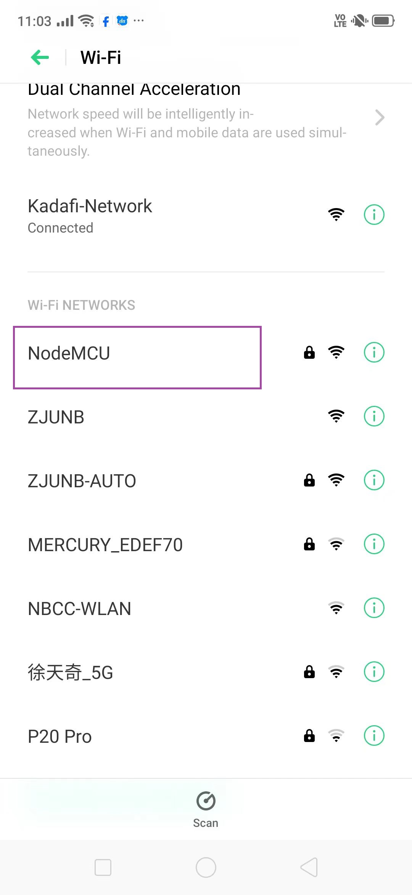

## Blinking LED with NodeMCU (ESP8266) and Arduino IDE

* This is a simple example of a project that uses an Arduino board to program a NodeMCU (ESP8266) to control an LED. 

## Wiring LEDs to NodeMCU
* Placing the NodeMCU on your breadboard, making sure that each side of the board is on a different side of the breadboard. 
* connect two LEDs to digital GPIO D6 and D7 using a 220Ω current limiting resistor.
## Configuring the NOdeMCU Web Server in Access Point (AP) mode
In this project, we  control things by visiting a specific URL.When you enter a URL into a web browser, it sends an HTTP request (also known as a GET request) to a web server. It is the web server’s responsibility to handle this request.

Assume you entered a URL like http://192.168.1.1/ledon into a browser. The browser then sends an HTTP request to the ESP8266. When the ESP8266 receives this request, it recognizes that the user wishes to turn on the LED. As a result, it turns on the LED and sends a dynamic webpage to a browser that displays the LED’s status as “on.” 
### steps
 connect your ESP8266 to your computer
 ESP8266WiFi.h library. This library contains ESP8266-specific methods that we use to connect to the network. Following that, we include the ESP8266WebServer.h library and run the sketch.
 ~~~
#include <ESP8266WiFi.h>
#include <ESP8266WebServer.h>

/* Put your SSID & Password */
const char* ssid = "NodeMCU";  // Enter SSID here
const char* password = "12345678";  //Enter Password here

/* Put IP Address details */
IPAddress local_ip(192,168,1,1);
IPAddress gateway(192,168,1,1);
IPAddress subnet(255,255,255,0);

ESP8266WebServer server(80);

uint8_t LED1pin = D7;
bool LED1status = LOW;

uint8_t LED2pin = D6;
bool LED2status = LOW;

void setup() {
  Serial.begin(9600);
  pinMode(LED1pin, OUTPUT);
  pinMode(LED2pin, OUTPUT);

  WiFi.softAP(ssid, password);
  WiFi.softAPConfig(local_ip, gateway, subnet);
  delay(100);
  
  server.on("/", handle_OnConnect);
  server.on("/led1on", handle_led1on);
  server.on("/led1off", handle_led1off);
  server.on("/led2on", handle_led2on);
  server.on("/led2off", handle_led2off);
  server.onNotFound(handle_NotFound);
  
  server.begin();
  Serial.println("HTTP server started");
}
void loop() {
  server.handleClient();
  if(LED1status)
  {digitalWrite(LED1pin, HIGH);}
  else
  {digitalWrite(LED1pin, LOW);}
  
  if(LED2status)
  {digitalWrite(LED2pin, HIGH);}
  else
  {digitalWrite(LED2pin, LOW);}
}

void handle_OnConnect() {
  LED1status = LOW;
  LED2status = LOW;
  Serial.println("GPIO7 Status: OFF | GPIO6 Status: OFF");
  server.send(200, "text/html", SendHTML(LED1status,LED2status)); 
}

void handle_led1on() {
  LED1status = HIGH;
  Serial.println("GPIO7 Status: ON");
  server.send(200, "text/html", SendHTML(true,LED2status)); 
}

void handle_led1off() {
  LED1status = LOW;
  Serial.println("GPIO7 Status: OFF");
  server.send(200, "text/html", SendHTML(false,LED2status)); 
}

void handle_led2on() {
  LED2status = HIGH;
  Serial.println("GPIO6 Status: ON");
  server.send(200, "text/html", SendHTML(LED1status,true)); 
}

void handle_led2off() {
  LED2status = LOW;
  Serial.println("GPIO6 Status: OFF");
  server.send(200, "text/html", SendHTML(LED1status,false)); 
}

void handle_NotFound(){
  server.send(404, "text/plain", "Not found");
}

String SendHTML(uint8_t led1stat,uint8_t led2stat){
  String ptr = "<!DOCTYPE html> <html>\n";
  ptr +="<head><meta name=\"viewport\" content=\"width=device-width, initial-scale=1.0, user-scalable=no\">\n";
  ptr +="<title>LED Control</title>\n";
  ptr +="<style>html { font-family: Helvetica; display: inline-block; margin: 0px auto; text-align: center;}\n";
  ptr +="body{margin-top: 50px;} h1 {color: #444444;margin: 50px auto 30px;} h3 {color: #444444;margin-bottom: 50px;}\n";
  ptr +=".button {display: block;width: 80px;background-color: #1abc9c;border: none;color: white;padding: 13px 30px;text-decoration: none;font-size: 25px;margin: 0px auto 35px;cursor: pointer;border-radius: 4px;}\n";
  ptr +=".button-on {background-color: #1abc9c;}\n";
  ptr +=".button-on:active {background-color: #16a085;}\n";
  ptr +=".button-off {background-color: #34495e;}\n";
  ptr +=".button-off:active {background-color: #2c3e50;}\n";
  ptr +="p {font-size: 14px;color: #888;margin-bottom: 10px;}\n";
  ptr +="</style>\n";
  ptr +="</head>\n";
  ptr +="<body>\n";
  ptr +="<h1>ESP8266 Web Server</h1>\n";
  ptr +="<h3>Using Access Point(AP) Mode</h3>\n";
  
   if(led1stat)
  {ptr +="<p>LED1 Status: ON</p><a class=\"button button-off\" href=\"/led1off\">OFF</a>\n";}
  else
  {ptr +="<p>LED1 Status: OFF</p><a class=\"button button-on\" href=\"/led1on\">ON</a>\n";}

  if(led2stat)
  {ptr +="<p>LED2 Status: ON</p><a class=\"button button-off\" href=\"/led2off\">OFF</a>\n";}
  else
  {ptr +="<p>LED2 Status: OFF</p><a class=\"button button-on\" href=\"/led2on\">ON</a>\n";}

  ptr +="</body>\n";
  ptr +="</html>\n";
  return ptr;
}
~~~
After uploading the sketch, open the Serial Monitor at 9600 baud and press the RESET button on the ESP8266. If everything is fine, it will show the “HTTP server started” message.
<br>

<br>
Now, get a phone, laptop, or other device that can connect to a WiFi network, and look for a network called “NodeMCU”. Connect to the network using the password 12345678.
<br>

<br>
After connecting to your NodeMCU AP network, open a browser and navigate to 192.168.1.1. The ESP8266 should return a web page displaying the current status of the LEDs and buttons. At the same time, you can check the serial monitor to see the status of the ESP8266’s GPIO pins.
<br>

<br>
<br>

<br>

## NodeMcu with Thinkspeak IOT
The Internet of Things ( or IoT) is a network of interconnected computing devices such as digital machines, automobiles with built-in sensors, or humans with unique identifiers and the ability to communicate data over a network without human intervention.

NodeMCU is an open source IoT platform. It includes firmware which runs on the ESP8266 WiFi SoC from Espressif, and hardware which is based on the ESP-12 module. 
It can be used as a standalone device, or as a UART to Wi-Fi adaptor to allow other microcontrollers to connect to a Wi-Fi network. For example, you can connect an ESP8266 to an Arduino to add Wi-Fi capabilities to your Arduino board. The most practical application is using it as a standalone device.

## Features
* Wi-Fi Module – ESP-12E module similar to the ESP-12 module but with 6 extra GPIOs.
* USB – micro USB port for power, programming and debugging
* Headers – 2x 2.54mm 15-pin header with access to GPIOs, SPI, UART, ADC, and power pinsMisc – Reset and Flash buttons
* Power – 5V via micro USB port
 interface DHT11 (temperature and humidity sensor) with NodeMCU
## CONNECTING THE NODEMCU, DHT11 Interfacing with ThingSpeak WebServer
### DHT11 (Temperature and Humidity Sensor)
* DHT11 is used to measure humidity and temperature from its surrounding. 
* It monitors the ambient temperature and humidity of a given area.
*  It consists of an NTC (negative temperature co-efficient) temperature sensor and a resistive type humidity sensor. 
* It also consists of an 8-bit microcontroller. The microcontroller is responsible for performing ADC (analog to digital conversion) and provides a digital output over the single wire protocol.

* DHT11 sensor can measure humidity from 20% to 90% with +-5% (RH or relative humidity) of accuracy and can measure the temperature in the range of 0 degrees Celsius to 50 degrees Celsius with +-2C of accuracy.DHT11 sensors can also be used to implement a wired sensor system using a cable length of up to 20 meters.
## Arduino Programming
* Install the DHT11 sensor library;
* Open Aurdino IDE and Go to Tools >> Manage Libraries.
<br>

<br>
* Type DHT in the search bar and install the DHT sensor library as shown below.
 <br>

<br>
Test code

## Wiring Instructions
Connect the DHT11 sensor to the NodeMCU as follows:
* DHT11 VCC to NodeMCU 3.3V
* DHT11 GND to NodeMCU GND
* DHT11 DATA to NodeMCU D4 (you can use any other GPIO pin, adjust code accordingly). Howerver in this test, in the code I define as D4 but when i connect to D4 on the nodeMCU, the sensor was not reading the values until i shift to the D2 on the NodeMCU. Remember not to change in the code. In the code, it should be defined as D4 but on NodeMCU connect to the D2 pin.
* Connect the NodeMCU to your computer using a USB cable or use an external power source.

 <br>

<br>
* Open the Arduino IDE and copy and paste the  code below 
Select the board as NodeMCU and port 
 <br>

<br>

* Compile and upload the program after selecting the correct development board and COM port.

~~~
#include "DHT.h"

#define DHTPIN 4 // Digital pin connected to the DHT sensor

#define DHTTYPE DHT11 // DHT 11

// Initializing the DHT11 sensor.

DHT dht(DHTPIN, DHTTYPE);

void setup() {
Serial.begin(9600);

Serial.println(F("DHT test string!"));

dht.begin();

}

 
void loop() {
// Wait a few seconds between measurements.

delay(2000);

// Reading temperature or humidity takes about 250 milliseconds!

// Sensor readings may also be up to 2 seconds 'old' (its a very slow sensor)

float h = dht.readHumidity();

// Read temperature as Celsius (the default)

float t = dht.readTemperature();

// Read temperature as Fahrenheit (isFahrenheit = true)

float f = dht.readTemperature(true);

// Check if any reads failed and exit early (to try again).

if (isnan(h) || isnan(t) || isnan(f)) {

Serial.println(F("Failed to read from DHT sensor!"));

return;

}

// Compute heat index in Fahrenheit (the default)

float hif = dht.computeHeatIndex(f, h);

// Compute heat index in Celsius (isFahreheit = false)

float hic = dht.computeHeatIndex(t, h, false);

Serial.print(F("Humidity(%): "));

Serial.println(h);

Serial.print(F("Temp.: "));

Serial.print(t);

Serial.println(F("°C "));

Serial.print(F("Temp.: "));

Serial.print(f);

Serial.println(F("°F "));

Serial.print(F("Heat index: "));

Serial.println(hic);

Serial.println(" ");

Serial.print(F("°C "));

Serial.print(hif);

Serial.println(F("°F"));

}
~~~
## Results 
<br>

<br>

## ThingSpeak web servie
* It is an open data platform for the Internet of Things (Internet of Things).
* ThingSpeak is a MathWorks web service that allows us to send sensor readings/data to the cloud. We can also visualise and act on the data (calculate the data) sent to ThingSpeak by the devices. Data can be stored in both private and public channels.

* ThingSpeak is commonly used for internet of things prototyping and proof of concept systems requiring analytics.
## Features Of ThingSpeak Introduction
* <b>ThingSpeak service enables users to share analyzed data through public channels:</b> Users can view multiple options on their channels via the settings panel. The tab displays sharing options, allowing the user to make their channel private, public or shared with specific users. Professionals can import and export data through their channels as well.

* <b>ThingSpeak allows professionals to prepare and analyze data for their businesses:</b> Weather forecasters use the MATLAB Analysis app to prepare, analyze, and filter data, such as estimating average humidity or calculating dew point. Users can use the visualization and analysis applications to perform operations on live or historical data by using template codes. To enable modular coding, industry professionals can add new functions to the software. Companies can use ThingSpeak Analysis to read stored data or write new data to their private channels. They can scrape numbers from various web pages thanks to the URL filter.

* <b>ThingSpeak updates various ThingSpeak channels using MQTT and REST APIs: </b>Professionals in the industry also use the platform to analyze and chart numerical data sent from smart devices and stored on various channels. Business owners can update their feeds, clear, or delete their channels entirely by using REST API calls like POST, GET, DELETE, or PUT. MQTT Publish methods allow users to update their feeds, whereas MQTT Subscribe methods allow them to receive messages.
## Preparing Arduino IDE for NodeMCU and ThingSpeak
We are using Arduino IDE to compile and upload code into the NodeMCU module.

* Hardware: NodeMCU(In this example we choice NodeMCU CP2102)
* Software:Arduino IDE
## Programming NodeMCU in Arduino IDE

To use the NodeMCU with the Arduino IDE, we need to add the ESP8266 board manager to the Arduino IDE. All we have to do is add the JSON file link. JSON is a format of text files that allow structured information to be shared between computers.
### Installation Of NodeMCU Library In Arduino IDE
Steps to follow to install NodeMCU Board Manager on Arduino IDE:
* Open Arduino IDE and Go to <b>file>> Preferences >></b> Change additional Boards Manages URL(http://arduino.esp8266.com/stable/package_esp8266com_index.json)

<br>

<br>

Go to <b>tools>> board >> Boards Manager</b> and search esp8266 ,then install (need several minutes). If success,open TOOLS-borads and find "NodeMCU1.0(ESP-12E Module)"

<br>

<br>
Go to tools>> board >> Boards Manager >>ESP8266>> "NodeMCU1.0(ESP-12E Module)"
<br>

<br>

## Preparing Arduino IDE for  ThingSpeak
* Click the link  to download theThingSpeak Arduino library:[ThingSpeak Arduino library](https://github.com/mathworks/thingspeak-arduino)
* Open the Arduino IDE.
* Go to <b>Sketch >> Include Library >> Add .ZIP Library</b> and select the downloaded zip file.
<br>

<br>
* To check whether the library is successfully added or not:
* Go to <b>Sketch >> Include Library >> Manage Libraries</b> Note: you can also add a library here
<br>

<br>
* Type thingspeak in the search bar.
<br>

<br>

* The ThingSpeak library by <b>MathWorks</b> has been successfully downloaded.

##  ThingSpeak IOT  platform setting 
* To create  account or log in to ThingSpeak (operated by MathWorks) server [here](https://thingspeak.com/)
* Click on <b>Get Started for free.</b>
<br>

<br>

* Click create account if this is your first time
<br>

<br>

* Enter your details to create a MathWorks account as shown below. Remember to use your school or work mail  to access your organization’s MATLAB license, use of personal gmail is prohibited
<br>

<br>

* If you have already created a MathWorks account, then click on Sign in.
<br>

<br>

* Create a channel on MathWorks server by clicking on the <b> New Channel</b>
* ThingSpeak web service allows its user to create and save maximum of 4 channels for free.
* If you are want access to more channels then you need to make payment for that.
<br>

<br>

* Enter the respective details in the channel.
<br>

<br>

* Here we are creating two fields. First one represents the temperature and another one is to represent the humidity measured using DHT11 sensor. You can also add more fields as per your requirements. CLICK SAVE CHANNEL
* A new URL containing the channel details and channel Stats will open, once you have successfully created the channel. On the same page/url, API keys are available for both read and write services.
* Go to API Keys and copy the write API key and paste in your Arduino IDE code. So that ESP8266 can send or write the DHT sensor readings to the MathWorks server.
<br>

<br>
<b>Take note of the channel id, write API key and Read API key as we are going to use  them in the code</b>

<br>

<br>

* In Private view your can also customize your chart. To edit the chart, click on the icon present on the top right corner of field chart.

<br>
Edit the details as per your requirements and click on the Save

<br>

## Testing
* Copy the code and paste it in the Aurdino IDE
```
//------style guard ----

#ifdef __cplusplus

extern "C" {

#endif

uint8_t temprature_sens_read();

#ifdef __cplusplus

}

#endif

uint8_t temprature_sens_read();

// ------header files----

#include <ESP8266WiFi.h>

#include "DHT.h"

#include "ThingSpeak.h"

//-----netwrok credentials

char* ssid = "replace this with your SSID"; //enter SSID

char* passphrase = "replace this with your password"; // enter the password

WiFiServer server(80);

WiFiClient client;

//-----ThingSpeak channel details

unsigned long myChannelNumber = 1; //Add the channel number and API (Write) Key. 

const char * myWriteAPIKey = "WRVXWOIQ89XVETRK"; //replace this with your API key

//----- Timer variables

unsigned long lastTime = 0;

unsigned long timerDelay = 1000;

//----DHT declarations

#define DHTPIN 4 // Digital pin connected to the DHT sensor

#define DHTTYPE DHT11 // DHT 11

// Initializing the DHT11 sensor.

DHT dht(DHTPIN, DHTTYPE);

 
void setup()
{

Serial.begin(9600); //Initialize serial

Serial.print("Connecting to ");

Serial.println(ssid);

WiFi.begin(ssid, passphrase);

while (WiFi.status() != WL_CONNECTED) {

delay(500);

Serial.print(".");

}

// Print local IP address and start web server

Serial.println("");

Serial.println("WiFi connected.");

Serial.println("IP address: ");

Serial.println(WiFi.localIP());

server.begin();

//----nitialize dht11

dht.begin();

ThingSpeak.begin(client); // Initialize ThingSpeak

}

void loop()
{

if ((millis() - lastTime) > timerDelay)

{

delay(2500);

// Reading temperature or humidity takes about 250 milliseconds!

float h = dht.readHumidity();

// Read temperature as Celsius (the default)

float t = dht.readTemperature();

float f = dht.readTemperature(true);

if (isnan(h) || isnan(t) || isnan(f)) {

Serial.println(F("Failed to read from DHT sensor!"));

return;

}

Serial.print("Temperature (ºC): ");

Serial.print(t);

Serial.println("ºC");

Serial.print("Humidity");

Serial.println(h);

ThingSpeak.setField(1, h);

ThingSpeak.setField(2, t);

// Write to ThingSpeak. There are up to 8 fields in a channel, allowing you to store up to 8 different

// pieces of information in a channel. Here, we write to field 1.

int x = ThingSpeak.writeFields(myChannelNumber,

myWriteAPIKey);

if(x == 200){

Serial.println("Channel update successful.");

}

else{

Serial.println("Problem updating channel. HTTP error code " + String(x));

}

lastTime = millis();

}

}

```

<br>

* Connect the ESP8266 module with your laptop using USB cable.
* Select the right development board in Tools >> Boards >>ESP8266>>NodeMCU 1.0 (ESP-12E Module)
* Compile and upload the code into ESP8266 using Arduino IDE.
* Make sure that you have entered the right Wi-Fi credentials, API key and channel number before uploading the code.


<br>


* Open the ThingSpeak website where you have created a channel and check the sensor readings.
* A screenshot of the field chart we have created is show below. Where you can see the temperature and humidity  sensor values on the chart.


